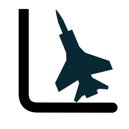

# LibreMiG-S

<!-- Improved compatibility of back to top link: See: https://github.com/othneildrew/Best-README-Template/pull/73 -->
<a name="readme-top"></a>
<!--
*** Thanks for checking out the Best-README-Template. If you have a suggestion
*** that would make this better, please fork the repo and create a pull request
*** or simply open an issue with the tag "enhancement".
*** Don't forget to give the project a star!
*** Thanks again! Now go create something AMAZING! :D
-->


<!-- PROJECT SHIELDS -->
<!--
*** I'm using markdown "reference style" links for readability.
*** Reference links are enclosed in brackets [ ] instead of parentheses ( ).
*** See the bottom of this document for the declaration of the reference variables
*** for contributors-url, forks-url, etc. This is an optional, concise syntax you may use.
*** https://www.markdownguide.org/basic-syntax/#reference-style-links
-->
[![Contributors][contributors-shield]][contributors-url]
[![Forks][forks-shield]][forks-url]
[![Stargazers][stars-shield]][stars-url]
[![Issues][issues-shield]][issues-url]
[![CERN-OHL-v2-S][license-shield]][license-url]
<!-- [![LinkedIn][linkedin-shield]][linkedin-url] -->

<!-- PROJECT LOGO -->
<br />
<div align="center">
  <a href="https://github.com/JustEnoughDucks/LibreMiG-S">
    
  </a>

  <h3 align="center">LibreMiG-S</h3>

  <p align="center">
    Open Source Joystick/Open Source Flightstick that combines the Olukelu Gimbal with a MiG-31 inspired Flightstick designed for Star Citizen or space simulators
    <!-- <br />
    <a href="https://github.com/JustEnoughDucks/LibreMiG-S"><strong>Explore the docs »</strong></a>
    <br /> -->
    <br /> 
    <a href="https://github.com/JustEnoughDucks/LibreMiG-S">View Demo</a>
    ·
    <a href="https://github.com/JustEnoughDucks/LibreMiG-S/issues">Report Bug</a>
    ·
    <a href="https://github.com/JustEnoughDucks/LibreMiG-S/issues">Request Feature</a>
  </p>
</div>


<!-- TABLE OF CONTENTS -->
<details>
  <summary>Table of Contents</summary>
  <ol>
    <li>
      <a href="#about-the-project">About The Project</a>
      <ul>
        <li><a href="#built-with">Built With</a></li>
      </ul>
    </li>
    <li>
      <a href="#getting-started">Getting Started</a>
      <ul>
        <li><a href="#prerequisites">Prerequisites</a></li>
        <li><a href="#installation">Installation</a></li>
      </ul>
    </li>
    <li><a href="#usage">Usage</a></li>
    <li><a href="#roadmap">Roadmap</a></li>
    <li><a href="#contributing">Contributing</a></li>
    <li><a href="#license">License</a></li>
    <li><a href="#contact">Contact</a></li>
    <li><a href="#acknowledgments">Acknowledgments</a></li>
  </ol>
</details>


<!-- ABOUT THE PROJECT -->
## About The Project

<!-- [![Product Name Screen Shot][product-screenshot]](https://example.com)-->

I saw few options for open-source flight sticks out there. Commercial options are exceedingly expensive. I strive to build a full-featured and high-quality Flightstick with a target BOM cost from 150-200€. It is not meant to be the cheapest joystick, but it does aim to be the most attractive option for open-source and DIY enthusiasts.

BOMs, parts lists, and documentation for various gimbals and 3D printed joysticks are sparse at best. I aim to include an extremely comprehensive requirements list, drop-in replacement part list, etc... so that this will be as accessible to everyone who has interest in building their own stick.

This is very open to all contributions and improvements from the community.

<p align="right">(<a href="#readme-top">back to top</a>)</p>


### Built With
<!--
* [![Next][Next.js]][Next-url]
* [![React][React.js]][React-url]
* [![Vue][Vue.js]][Vue-url]
* [![Angular][Angular.io]][Angular-url]
* [![Svelte][Svelte.dev]][Svelte-url]
* [![Laravel][Laravel.com]][Laravel-url]
* [![Bootstrap][Bootstrap.com]][Bootstrap-url]
* [![JQuery][JQuery.com]][JQuery-url]
-->
<p align="right">(<a href="#readme-top">back to top</a>)</p>


<!-- GETTING STARTED -->
## Getting Started

This process is hopefully as painless as possible. It will take hours of printing, some of soldering, assembling, and testing to make sure everything works. In order to have the most quality product as possible and respect the supply chain issues everyone has, I chose the cheapest, most available chip that is also easy to solder onto the PCB, but also has integrated USB so you don't need to search for an elusive USB HID FTDI chip. Everything can be assembled and disassembled repeatedly in principle (minimal/no direct screw to print interfaces)

I also added alternate electronics headers so that one can use an [STM32 Bluepill](https://microcontrollerslab.com/stm32f103c8t6-blue-pill-pinout-peripherals-programming-features/) in place of the USB, MCU, and power components if you don't like soldering. The upside to this is that I may be able to make a firmware profile compatible with FreeJoy in the future. I will have to look into compatibility with I2C peripherals in FreeJoy. If one is using the embedded MCU, then it will require the custom firmware. Everything should be plug-and-play with no drivers needed because proper USB descriptors will be developed.

### Prerequisites

This is a very general list of the materials you will need to assemble and program the stick. All BOM items are assumed to be ordered and received.

<!--  ```sh
  npm install npm@latest -g
  ```
-->
* 3D Printer
* Soldering Iron/Soldering Station + solder + flux paste/pen
* Microscope for soldering
* Hex key drivers and philips 0 screwdriver (dependent on your bolt choice)
* Mechanical and electrical BOM materials
* Manufactured PCBs
* ST-Link V2 or STM32F0 disovery board + jumpers for programming MCU
* USB-C cable
* PC running Linux or Windows
* STM32CubeProgrammer or PlatformIO on VSCode/Code-OSS
  
### Installation

<!-- 1. Get a free API Key at [https://example.com](https://example.com)
2. Clone the repo
   ```sh
   git clone https://github.com/github_username/repo_name.git
   ```
3. Install NPM packages
   ```sh
   npm install
   ```
4. Enter your API in `config.js`
   ```js
   const API_KEY = 'ENTER YOUR API';
   ```
-->
<p align="right">(<a href="#readme-top">back to top</a>)</p>


<!-- USAGE EXAMPLES -->
## Usage

<!-- Use this space to show useful examples of how a project can be used. Additional screenshots, code examples and demos work well in this space. You may also link to more resources.

_For more examples, please refer to the [Documentation](https://example.com)_ -->

<p align="right">(<a href="#readme-top">back to top</a>)</p>


<!-- ROADMAP -->
## Roadmap

- [X] 3D printed shells and parts designed
- [ ] 3D printed parts fully printable and assemblable
- [X] PCBs made in single panel and multi-board configurations
- [ ] Windows and Linux compatible firmware
    - [ ] Firmware can detect a TM/Virpil grip and fall back into "basic mode"
    - [ ] Drivers if needed
- [ ] Assembly Instructions
    - [ ] Video
- [ ] Button binding instructions
    - [ ] Video
- [ ] BOM for electronics
- [ ] BOM for mechanics
- [ ] Cost estimates for 1 american, 1 european, and 1 chinese manufacturers
- [ ] Documentation
- [ ] Possibly selling electronics kits or assembed kits?


See the [open issues](https://github.com/JustEnoughDucks/LibreMiG-S/issues) for a full list of proposed features (and known issues).

<p align="right">(<a href="#readme-top">back to top</a>)</p>


<!-- CONTRIBUTING -->
## Contributing

Contributions are what make the open source community such an amazing place to learn, inspire, and create. Any contributions you make are **greatly appreciated**.

If you have a suggestion that would make this better, please fork the repo and create a pull request. You can also simply open an issue with the tag "enhancement".
Don't forget to give the project a star! Thanks again!

1. Fork the Project
2. Create your Feature Branch (`git checkout -b feature/AmazingFeature`)
3. Commit your Changes (`git commit -m 'Add some AmazingFeature'`)
4. Push to the Branch (`git push origin feature/AmazingFeature`)
5. Open a Pull Request

<p align="right">(<a href="#readme-top">back to top</a>)</p>


<!-- LICENSE -->
## License

Distributed under the CERN-OHL-S-v2 License. See [`LICENSE`](https://github.com/JustEnoughDucks/LibreMiG-S/blob/main/LICENSE) for more information.

<p align="right">(<a href="#readme-top">back to top</a>)</p>


<!-- CONTACT -->
## Contact

<!-- Benjamin - [@twitter_handle](https://twitter.com/twitter_handle) - email@email_client.com -->

Project Link: [https://github.com/JustEnoughDucks/LibreMiG-S](https://github.com/JustEnoughDucks/LibreMiG-S)

<p align="right">(<a href="#readme-top">back to top</a>)</p>


<!-- ACKNOWLEDGMENTS -->
## Acknowledgments

* []()
* []()
* []()

<p align="right">(<a href="#readme-top">back to top</a>)</p>

<!-- MARKDOWN LINKS & IMAGES -->
<!-- https://www.markdownguide.org/basic-syntax/#reference-style-links -->
[contributors-shield]: https://img.shields.io/github/contributors/JustEnoughDucks/LibreMiG-S?style=for-the-badge
[contributors-url]: https://github.com/JustEnoughDucks/LibreMiG-S/graphs/contributors
[forks-shield]: https://img.shields.io/github/forks/JustEnoughDucks/LibreMiG-S?style=for-the-badge
[forks-url]: https://github.com/JustEnoughDucks/LibreMiG-S/network/members
[stars-shield]: https://img.shields.io/github/stars/JustEnoughDucks/LibreMiG-S?style=for-the-badge
[stars-url]: https://github.com/JustEnoughDucks/LibreMiG-S/stargazers
[issues-shield]: https://img.shields.io/github/issues/JustEnoughDucks/LibreMiG-S?style=for-the-badge
[issues-url]: https://github.com/JustEnoughDucks/LibreMiG-S/issues
[license-shield]: https://img.shields.io/badge/License-CERN--OHL--v2--S-brightgreen?style=for-the-badge
[license-url]: https://ohwr.org/cern_ohl_s_v2.pdf
[linkedin-shield]: https://img.shields.io/badge/-LinkedIn-black.svg?style=for-the-badge&logo=linkedin&colorB=555
[linkedin-url]: https://linkedin.com/in/linkedin_username
[product-screenshot]: images/screenshot.png
[Next.js]: https://img.shields.io/badge/next.js-000000?style=for-the-badge&logo=nextdotjs&logoColor=white
[Next-url]: https://nextjs.org/
[React.js]: https://img.shields.io/badge/React-20232A?style=for-the-badge&logo=react&logoColor=61DAFB
[React-url]: https://reactjs.org/
[Vue.js]: https://img.shields.io/badge/Vue.js-35495E?style=for-the-badge&logo=vuedotjs&logoColor=4FC08D
[Vue-url]: https://vuejs.org/
[Angular.io]: https://img.shields.io/badge/Angular-DD0031?style=for-the-badge&logo=angular&logoColor=white
[Angular-url]: https://angular.io/
[Svelte.dev]: https://img.shields.io/badge/Svelte-4A4A55?style=for-the-badge&logo=svelte&logoColor=FF3E00
[Svelte-url]: https://svelte.dev/
[Laravel.com]: https://img.shields.io/badge/Laravel-FF2D20?style=for-the-badge&logo=laravel&logoColor=white
[Laravel-url]: https://laravel.com
[Bootstrap.com]: https://img.shields.io/badge/Bootstrap-563D7C?style=for-the-badge&logo=bootstrap&logoColor=white
[Bootstrap-url]: https://getbootstrap.com
[JQuery.com]: https://img.shields.io/badge/jQuery-0769AD?style=for-the-badge&logo=jquery&logoColor=white
[JQuery-url]: https://jquery.com 
